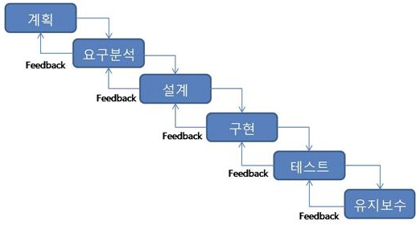
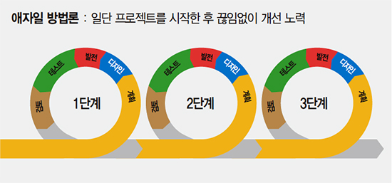
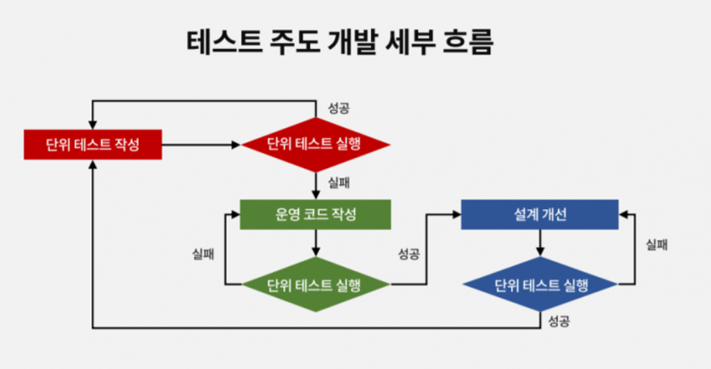

# 소프트웨어 개발 방법론
## 폭포수 방법론

[특징]
미리 정의된 요구 사항을 수집한 다음 전체적으로 분석 및 디자인을 한 뒤 한번에 완성한다.
이전 단계를 완전히 끝낸 후 다음 단계로 진행한다.

[장점]
명확한 문서화로 전체 과정에 대한 이해가 쉽다는 것과 프로젝트 관리가 용이하다는 점이 있다.

[단점]
실제 개발에서는 요구 사항이 변경될 가능성이 크기 때문에 개발 단계 진행에 차질이 생길 수 있다.
또한 소프트웨어 작동 여부를 개발 후반부에 확인할 수 있기 때문에 수정이 어렵다.
마지막 단계 전까지 통합을 하지 않으므로 이전까지 테스트를 진행할 수 없다.

[종합]
계획이 잘 짜여져 있다면 초기 단계에 결함을 보완해 비용을 줄일 수 있지만, 계획에 문제가 있다면 마지막 단계에 통합을
하는 만큼 비용이 많이 들 수 있다. 그만큼 계획이 중요하고 실제 프로젝트에서는 이상적이라는 비판이 있다.
그리고 실제로는 여러 요소로 인해 요구 사항이 변경되는 경우가 생기기 때문에 폭포수 유형은 적절하지 못할 수 있다.

### [연관] DDD(Domain Driven Development, 도메인 주도 개발)
기존의 폭포수 모델에서 동일하게 가지고 있는 문제를 해결하면서 나온 도메인 주도의 개발 방법론.

소프트웨어로 해결해야 할 문제의 영역인 도메인을 중심으로 설계해 내가는 방법으로, 순수하게 모델과 로직에 집중한다.
커뮤니케이션에 있어서 분석, 설계, 구현 단계에 이르기까지 통일된 방식으로 커뮤니케이션을 하며 협업을 한다.

DDD는 기능, 구현 목표 및 다양한 수준의 수가 많아
기존 응용 프로그램 디자인에서 개념적으로 캡처하기 어려운 복잡한 프로젝트에 대한 훌륭한 솔루션이다.
이를 위해 유비쿼터스 언어를 사용하는데 전문가, 관계자, 개발자 등이 도메인과 관련된 공통의 언어를 만들고
이를 대화, 문서, 도메인 모델, 코드, 테스트 등 모든 곳에서 같은 용어로 사용한다.

그 덕분에 데이터 중심 설계 방식의 단점인 캡슐화의 원칙 위반을 예방할 수 있다.
또한 프로그래머가 도메인을 올바르게 해석하고 사용자의 요구 사항을 충족시킬 수 있다.

하지만 DDD 방식의 개발은 초기 진입장벽이 높고 생소하다.
그리고 애플리케이션을 설계하고 구축하는 초기 생산 비용이 높다는 단점이 있다.

고로, 비즈니스와 기술적 측면 간의 커뮤니케이션이 중요하며
비즈니스 특성과 요구사항을 정확히 파악하고 IT 소통에서 컴파일러 역할을 할 도메인 전문가의 존재가 중요하다.

## 애자일(Agile) 방법론
작업 계획을 짧은 단위로 세우고 제품을 만들며 고쳐 나가는 사이클을 반복함으로써 
고객의 요구 변화에 유연하고도 신속하게 대응하는 개발 방법론이다.

[진행 순서]  
(주문 -> 디자인 -> 기능구현 -> 테스팅 -> 배포) * N회 반복

[특징]
기능을 축소하고 주기(스프린트)를 짧고 빠르게 하여 중간 테스트(피드백)을 많이 가진다.
시장과 고객의 변화가 빨라지고 미래를 예상하기 어려운 IT업계에 적합한 소프트웨어 개발 방식이다.

[장점]
계획 혹은 기능에 대한 수정과 변경에 유연하다.
프로젝트에 걸리는 시간을 최소화할 수 있다.
고객 요구 사항에 대한 즉각적인 피드백에 유연하다.

[단점]
계획 및 요구 사항의 변경으로 인한 반복적인 유지보수 작업이 많다.
고객의 요구 사항 및 계획이 크게 변경되면 모델이 무너질 수 있다.
개인이 아닌 팀이 중심이 되다 보니 회의, 로그 등 공통으로 해야 할 작업이 많을 수 있다.

### [연관] TDD(Test-Driven Development, 테스트 주도 개발)
테스트를 중요시 하는 개발 방법론.

실패하는 테스트 코드를 실제 코드보다 먼저 작성한 후, 
작성한 실패한 테스트 코드를 통과할 정도의 실제 코드를 작성한다.

이를 통해 불필요한 설계를 피할 수 있고, 정확한 요구 사항에 집중할 수 있다.
(요약: 일단 테스트를 통과하는 코드를 작성하고, 상황에 맞게 리팩토링한다)

테스트 코드를 먼저 작성한 후 테스트 코드를 통과하는 코드를 작성하며 리팩토링하는 과정을
반복하는 TDD 개발 방식은 스프린트를 반복하는 애자일 환경에 적합하다고 볼 수 있으며,
실제로 애자일 방법론으로 프로젝트를 수행할 때 주로 사용하는 개발 방법론이다.

반복적인 리팩토링을 통해 객체지향 SOLID 원칙을 준수해 나가 결론적으로
객체 지향 개발 원칙을 지키게 된다.

[장점]
기능 별 모듈화를 통해 종속성이 낮은 코드를 만들 수 있다.
에러 및 버그가 적어 디버깅 시간을 단축할 수 있다.

[단점]
테스트 코드를 추가적으로 개발해야 하므로 생산성이 낮아질 수 있다.
초기 세팅 비용이 들며 숙련되기 까지 시간이 소요된다.
개발 기간이 촉박한 프로젝트에 사용하기 어려울 수 있다.

## 결론
프로젝트를 진행하기 위해 프로그래머와 PM등 과의 원만한 협업과 커뮤니케이션은 필수이다.
그리고 프로그램을 설계하고 개발하며 테스트하는 방법과 순서 또한 중요하다.

이러한 문제들을 아우르는 소프트웨어 개발 방법론으로 크게 폭포수 방법론과 애자일 방법론이 있다.
두 방법론의 장단점을 파악하여 성공시키고자 하는 프로젝트에 맞는 방법론을 채택하는 것이 중요하다.

현재는 시장과 고객의 변화가 빨라지고 미래를 예상하기 어렵기 때문에 1~2주의 스프린트를 반복하는
애자일 기법이 일반적으로 유리한 편이다.

그 와중에 TDD, DDD를 선택할 수 있다.
테스트 코드를 먼저 작성하여 실제 코드를 작성해 나가는 방식으로,
코드 스멜을 제거하며 SOLID 원칙을 보다 손쉽게 지킬 수 있는 TDD 방식과

개발 전체 레이아웃을 개발 초기에 설정한 다음 순차적으로 개발을 진행하는 DDD 방식 중에서 
목표로 하는 프로젝트에 적합한 방식을 선택하는 것이 중요하다고 할 수 있다.

결국 프로젝트 완성이라는 공동의 목표 아래 개발 방향을 설정하고, 원칙을 정해
개발 비용인 시간과 자본, 노력을 최소화 해 투자 대비 최대 이윤을 남기는 것이 목표일 것이다.

이 속에서 커뮤니케이션 능력과 개발 능력(Java로 치자면 객체 지향 프로그래밍 능력)향상은 덤일 것이다.
